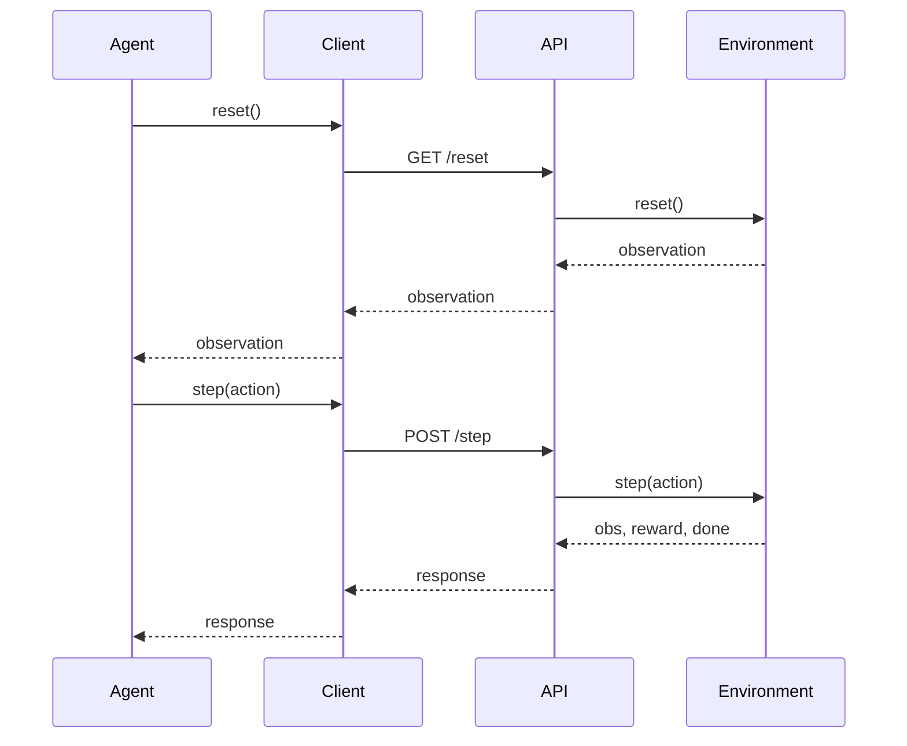

# 🚀 UsefulEnv: Smart Irrigation RL Environment

## 🧠 Overview

UsefulEnv is a real-world inspired reinforcement learning environment that simulates **adaptive smart irrigation management**.  
It allows an agent to interact with environmental conditions such as **soil moisture, crop health, and water availability**, making decisions under uncertainty.

The environment provides:
- Context-aware rewards  
- Multiple difficulty levels  
- Dynamic environmental changes (rain, drying)  
- Realistic constraints like limited water and time pressure  

---

## 🎯 Objective

To create a scalable and realistic environment where AI agents can:
- Learn optimal irrigation strategies  
- Balance crop health and water usage  
- Handle environmental uncertainty  
- Optimize long-term decision-making  

---

## 🧩 System Architecture

```mermaid
flowchart TD
    A[Baseline Agent] --> B[client.py]
    B --> C[FastAPI Server (app.py)]
    C --> D[Environment Logic (environment.py)]
    D --> E[Reward + State Update]
    E --> C
    C --> B
    B --> A
    D --> F[Grader (grader.py)]
```

---

## 🔄 Interaction Flow



---

## 🧩 Environment Design

```json
{
  "time": 3,
  "soil_moisture": 0.45,
  "crop_health": 0.75,
  "water_available": 6
}
```

```json
{
  "time": 10,
  "soil_moisture": 0.65,
  "crop_health": 0.85,
  "water_available": 3
}
```

---

## 🎮 Actions

| Action Type     | Purpose              | When to Use              | Example                  |
|----------------|---------------------|--------------------------|--------------------------|
| irrigate_low   | Add small water     | Slightly dry soil        | moisture = 0.35          |
| irrigate_high  | Add more water      | Very dry soil            | moisture = 0.2           |
| wait           | No irrigation       | Optimal moisture         | moisture = 0.5           |

---

## 🎯 Reward System

| Condition                     | Action         | Reward        |
|------------------------------|---------------|--------------|
| Optimal moisture (0.4–0.7)   | any           | +1.0         |
| Crop health improves         | correct action| +1.0         |
| Poor moisture                | any           | -1.0         |
| Over-irrigation (>0.8)       | irrigate      | -0.5         |
| Water usage                  | irrigate      | -0.1 / -0.2  |
| Invalid action               | any           | -0.5         |
| Delay penalty                | slow decision | -0.05 × step |

---

## 🧪 Difficulty Levels

| Level  | Soil Moisture | Water Available | Description                  |
|--------|--------------|----------------|------------------------------|
| Easy   | Moderate     | High           | Stable conditions            |
| Medium | Slightly dry | Moderate       | Balanced challenge           |
| Hard   | Dry          | Low            | Resource-constrained scenario|

---

## 📊 Grader System

The grader evaluates agent performance:

```
Score = average reward over steps
```

* Range: **0 to 1**  
* Based on efficiency and crop health maintenance  

---

## 🤖 Baseline Agent

A rule-based agent that:

- Irrigates when soil is dry  
- Waits when moisture is optimal  
- Avoids over-irrigation  

Used to:

- Demonstrate environment functionality  
- Provide benchmark performance  

---

## 📂 Project Structure

```
usefulenv/
│
├── server/
│   ├── app.py
│   ├── environment.py
│   ├── grader.py
│
├── client.py
├── baseline.py
├── models.py
├── openenv.yaml
├── Dockerfile
├── requirements.txt
└── README.md
```

---

## 🌐 API Endpoints

| Endpoint  | Method | Purpose                      |
|----------|--------|------------------------------|
| /reset    | GET    | Start new irrigation cycle   |
| /step     | POST   | Apply irrigation action      |
| /state    | GET    | Get environment state        |
| /tasks    | GET    | Difficulty levels            |
| /grader   | GET    | Evaluate performance         |
| /baseline | GET    | Run baseline agent           |

---

## 🧠 System Components

| Component   | File           | Role                         |
|------------|--------------|------------------------------|
| Environment | environment.py | Irrigation simulation logic  |
| API Server  | app.py         | Endpoint handling            |
| Client      | client.py      | Agent interface              |
| Baseline    | baseline.py    | Rule-based agent             |
| Grader      | grader.py      | Performance evaluation       |

---

## ⚙️ Setup & Run

### Install dependencies

```
pip install -r requirements.txt
```

---

### Run server

```
uvicorn server.app:app --reload
```

---

### Test API

```
http://localhost:8000/reset
```

---

### Run baseline

```
python baseline.py
```

---

## 🐳 Docker Setup

```
docker build -t usefulenv .
docker run -p 8000:8000 usefulenv
```

---

## 🚀 Deployment

```
openenv push --repo-id YOUR_USERNAME/usefulenv
```

---

## 🔥 Key Features

* Smart irrigation simulation  
* Resource-aware decision making  
* Dynamic environment (rain + drying)  
* Multi-step reinforcement learning  
* Real-world agricultural application  
* Scalable OpenEnv architecture  

---

## 🧾 Evaluation Criteria Alignment

| Criteria           | Implementation                    |
|------------------|----------------------------------|
| Real-world utility | Smart irrigation system 🌱        |
| Task quality       | Multi-step decisions             |
| Environment design | Dynamic + stochastic             |
| Code quality       | Modular OpenEnv structure        |
| Creativity         | Water optimization + uncertainty |

---

## 🎯 Conclusion

UsefulEnv provides a scalable and realistic reinforcement learning environment for smart irrigation, enabling agents to make efficient, resource-aware decisions under uncertainty while maintaining crop health and sustainability.